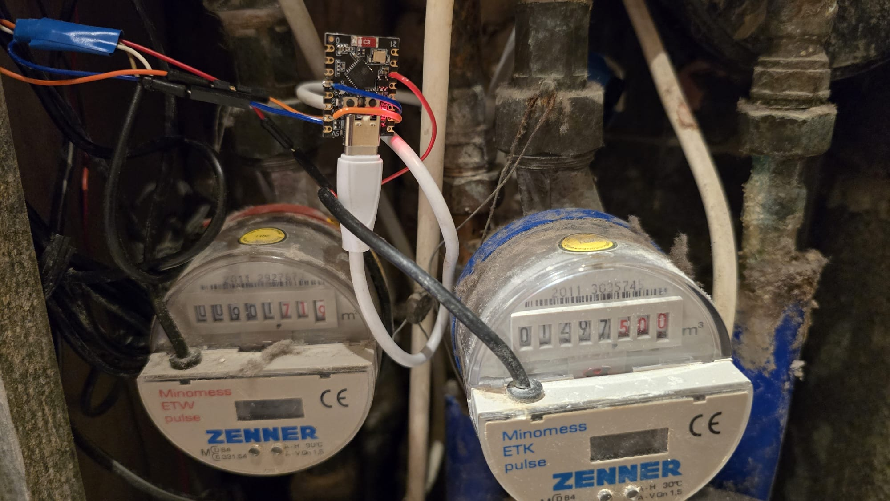
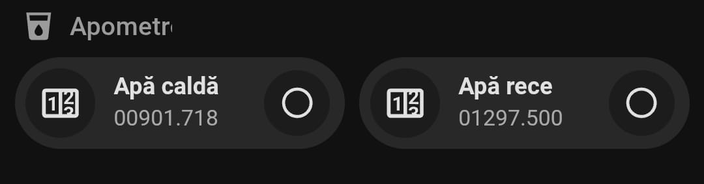

# ESP32-C3 Water Meters (Hot + Cold) — ESPHome + Home Assistant

Minimal, robust setup to read two reed switches from hot/cold water meters with an ESP32‑C3 SuperMini and expose totals (L and m³), rates (L/min), and utility meters (daily/monthly) in Home Assistant. UI uses Bubble Card.

## Quick start
1. Flash ESP32‑C3 with `esphome/apm.yaml` (update Wi‑Fi + static IP).
2. Drop `homeassistant/packages/apometre_mini.yaml` into your HA config and restart.
3. Add the Lovelace examples from `homeassistant/lovelace/` (requires HACS + Bubble Card).
4. Calibrate using the pop‑ups (set mechanical odometer and **Apply**).

## Docs
- 🇷🇴 Romanian: `README.ro.md`
- 🇬🇧 English: `README.en.md`

## Folder layout
See the `homeassistant/` and `esphome/` subfolders for ready-to-use YAML.
Images for wiring/UI are under `images/`.

## License
MIT — see `LICENSE`.

## Story
- 🇷🇴 [Povestea proiectului](STORY.ro.md)
- 🇬🇧 [Build story](STORY.en.md)

## 🔩 Hardware (BOM) & example links *(non-affiliate)*

> **Note:** the links below point to Romanian retailers and are provided **as examples only**.  
> You can use **any equivalent parts** available in your country/region.

- **ESP32-C3 SuperMini (Wi-Fi/BLE)** — small, cheap, works great with ESPHome  
  Example: <https://sigmanortec.ro/placa-dezvoltare-esp32-c3-supermini-33v-wifi-bluetooth>
- **Home Assistant (any host)** — tested with HA Green, but a Pi/mini-PC works too  
  Example: <https://www.wifistore.ro/cumpara/home-assistant-green-84102>
- **(Optional) ZigBee USB dongle (Sonoff ZBDongle-E)** — **not required** for this project; Wi-Fi via ESPHome is used  
  Example: <https://www.vonmag.ro/produse/info/zbdongle-e-6920075777659-pret-gateway-zigbee-30-usb-dongle-plus-e-sonoff>
- **Water meters with reed switch (dry contact)** — *any brand/model is fine*  
  Examples (RO):  
  Hot: <https://www.emag.ro/contor-de-apa-zenner-etwd-apa-calda-1-2-kxg0190904/pd/D7560TMBM/>  
  Cold: <https://www.emag.ro/contor-de-apa-zenner-etkd-apa-rece-1-2-kxg0190903/pd/DD560TMBM/>

**Compatibility:** any meter that exposes a **reed contact** will work.  
If your meter uses a different scale (e.g. **1 pulse = 10 L**), change the `on_press` increment in ESPHome and the m³ conversion in the HA package.

---

## 🔩 Echipamente (BOM) & link-uri *(fără afiliere)*

> **Notă:** link-urile de mai jos sunt către magazine din România și sunt **doar exemple**.  
> Poți folosi **echivalente** din țara/regiunea ta.

- **ESP32-C3 SuperMini (Wi-Fi/BLE)** — mic, ieftin, perfect pentru ESPHome  
  Exemplu: <https://sigmanortec.ro/placa-dezvoltare-esp32-c3-supermini-33v-wifi-bluetooth>
- **Home Assistant (orice host)** — testat pe HA Green, dar merge și pe Pi/mini-PC  
  Exemplu: <https://www.wifistore.ro/cumpara/home-assistant-green-84102>
- **(Opțional) Dongle ZigBee (Sonoff ZBDongle-E)** — **nu e necesar** pentru proiectul ăsta; folosim Wi-Fi via ESPHome  
  Exemplu: <https://www.vonmag.ro/produse/info/zbdongle-e-6920075777659-pret-gateway-zigbee-30-usb-dongle-plus-e-sonoff>
- **Apometre cu contact reed (contact uscat)** — *orice brand/model e ok*  
  Exemple (RO):  
  Apă caldă: <https://www.emag.ro/contor-de-apa-zenner-etwd-apa-calda-1-2-kxg0190904/pd/D7560TMBM/>  
  Apă rece: <https://www.emag.ro/contor-de-apa-zenner-etkd-apa-rece-1-2-kxg0190903/pd/DD560TMBM/>

**Compatibilitate:** e suficient ca apometrul să aibă **contact reed**.  
Dacă scara e **1 impuls = 10 L** (sau altă valoare), ajustezi incrementul în `on_press` (ESPHome) și conversia în m³ în pachet.

> **Default language: English.** Romanian examples live under `examples/ro/`
> and are **not** loaded by Home Assistant by default.

