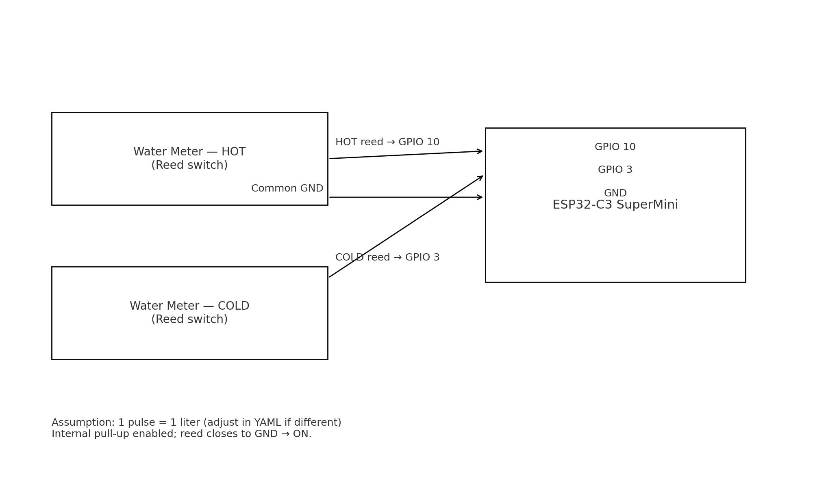
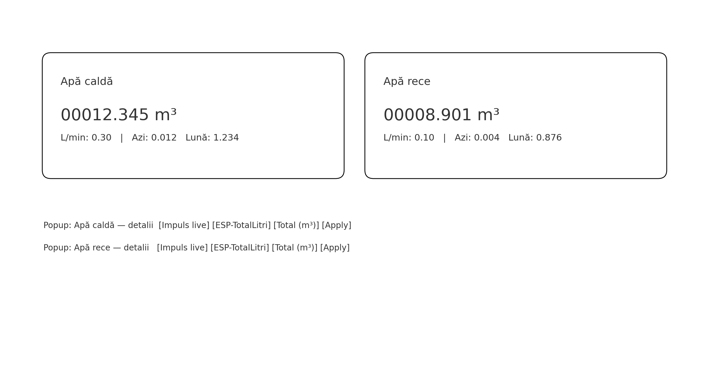

# Build story — ESP32‑C3 + ESPHome + Home Assistant water meters

> TL;DR: I wanted real‑time **water usage** (cold + hot), per day/month, in a clean Home Assistant UI. ESPHome keeps it simple (no custom code), two reed switches from the meters, and a *Bubble Card* UI.

## Why
- Align digital reading with the **mechanical odometer** (offset).
- See **L/min** when water flows (leak diagnostics).
- Get **daily/monthly utility meters** out of the box.

## Hardware & wiring
- Board: **ESP32‑C3 SuperMini**
- 2× water meters with **reed** (we use **1 pulse = 1 L** as default)
- Wiring: each reed between **GPIO** and **GND** (internal pull‑up, `inverted: true`)

## Firmware (ESPHome)
File: `esphome/apm.yaml`. Publishes **L** and **m³** totals for **cold** and **hot** and keeps the odometer in `globals` so you don’t lose values on reboot.

> You can change pins; just pick GPIOs with input + pull‑up. If hot/cold is swapped, change pin numbers.

## Home Assistant package
File: `homeassistant/packages/apometre_mini.yaml`.
- **Offset** per channel (m³), set from UI via input_number.
- **Odometer string** formatted as `00000.000 m³` for clarity.
- **L/min** derivative (based on ESP liters).
- **utility_meter** (daily/monthly) on **corrected** values (offset included).

## UI — Bubble Card
Two large odometer buttons and two pop‑ups with details including **Live pulse** (binary_sensor), **Total L**, **Total m³**, **L/min**, **Daily/Monthly consumption**, plus **Set odometer** with a single Apply click.

## Calibration — 30 seconds
1. Read your mechanical odometer (m³) for hot/cold.
2. Enter it in `input_number.apa_*_setare_odometru_m3` in the pop‑up.
3. Click **“Aplică setarea / Apply setting”** — the script computes **offset** and **calibrates utility meters** to avoid spikes.

## Lessons learned
- **15 ms** debounce works well; if you see bouncing, try 10–30 ms.
- For different pulse scales (e.g., 1 pulse = 10 L), change the `on_press` increment and m³ conversion.

## Cost & time
- ESP32‑C3 + wires: inexpensive.
- Build time: about 1–2 hours including UI and calibration.

---

👉 **Rebuild it** by following `README.md` for the quick path and check the YAML files in the repo. Questions? Open Issues/Discussions!
