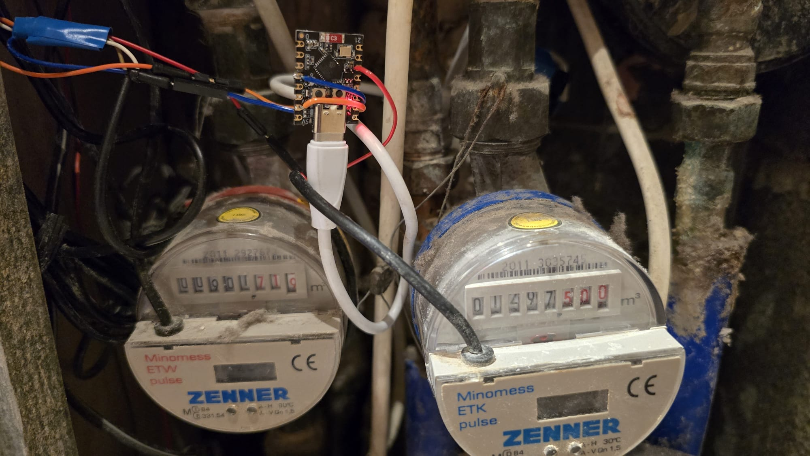
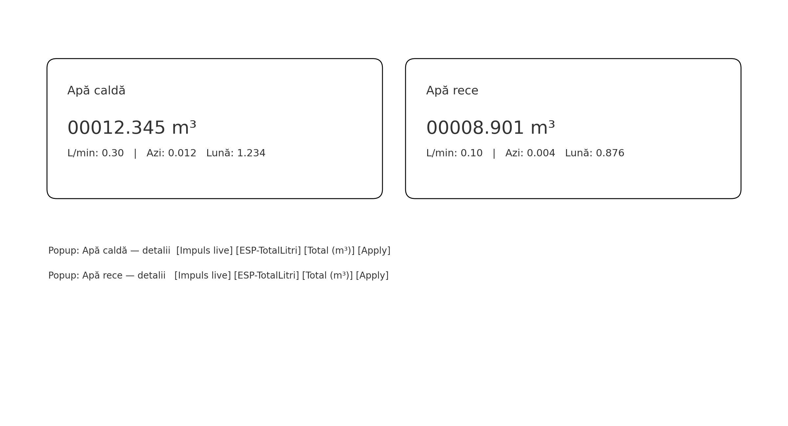

# Povestea proiectului — Apometre cu ESP32‑C3 + ESPHome + Home Assistant

> TL;DR: am vrut să văd **câtă apă consum** (rece + caldă), în timp real și pe zile/luni, într‑un UI simplu în Home Assistant. Am ales ESPHome pentru simplitate (fără cod custom), doi senzori reed din apometre și un UI *Bubble Card*.

## De ce
- Să aliniez contorul digital cu **odometrul mecanic** (offset).
- Să văd **L/min** când chiar curge apa (diagnostic pentru scurgeri).
- Să am **utility_meter** zilnic/lunar fără bătăi de cap.

## Hardware & wiring
- Placa: **ESP32‑C3 SuperMini**
- 2× apometre cu **contact reed** (1 puls = 1 L în exemplul nostru)
- Cablare: fiecare reed între **GPIO** și **GND** (pull‑up intern, `inverted: true`)

## Firmware (ESPHome)
Fișierul: `esphome/apm.yaml`. Publică totaluri în **L** și **m³** pentru **rece** și **caldă** și păstrează odometrul în `globals`, ca să nu pierzi valorile la reboot.

> Pinii pot fi ajustați; important e să alegi GPIO care suportă input + pull‑up. Dacă ai inversat rece/caldă, doar schimbi numerele de pin.

## Home Assistant — pachetul
Fișierul: `homeassistant/packages/apometre_mini.yaml`.
- **Offset** per canal (m³), setat din UI prin input_number.
- **Odometer string** format `00000.000 m³` pentru UX clar.
- **L/min** (derivative din litri ESP).
- **utility_meter** (zi/lună) pe valorile **corectate** (offset incl.).

## UI — Bubble Card
Două butoane mari cu odometre și două pop‑up‑uri cu detalii, inclusiv **Impuls live** (binary_sensor), **Total L**, **Total m³**, **L/min**, **Consum azi/lună**, plus **Setare odometru** cu un click pe „Aplică”.

## Calibrare — 30 de secunde
1. Citești odometrul mecanic (m³) pentru rece/caldă.
2. Îl introduci în `input_number.apa_*_setare_odometru_m3` din pop‑up.
3. Apeși **„Aplică setarea”** — scriptul calculează **offset** și **calibrează utility_meter** ca să evite spike‑urile.

## Ce am învățat
- Debounce de **15 ms** e ok în majoritatea cazurilor; dacă vezi dublări, testează 10–30 ms.
- Pentru contoare cu altă scară (ex. 1 puls = 10 L), schimbă incrementul în `on_press` și formula m³.

## Cost & timp
- ESP32‑C3 + cabluri: accesibil.
- Implementare: 1–2 ore, inclusiv UI și calibrare.

---

👉 **Vrei să refaci proiectul?** Urmează `README.md` pentru pașii rapizi și aruncă un ochi pe YAML‑urile din repo. Dacă ai întrebări, folosește Issues/Discussions!
